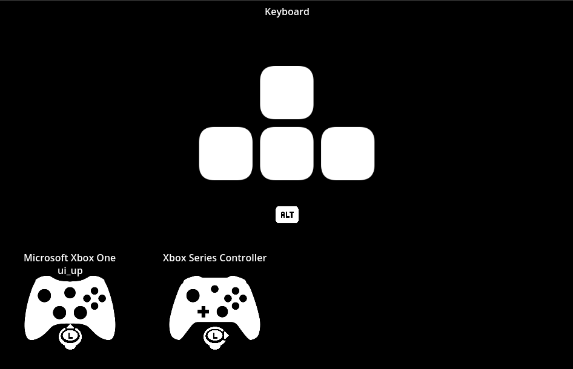

# Input Prompts

A simple Godot package to display input prompts for multiple devices.

## Gettings Started

### Installation

1. At minimum, download `input_prompts_configuration.tres` and the `addons/input_prompts` directory.
1. In `Project Settings > Plugins`, find the `InputPrompts` addon and click the `Enable` check box. 

### Configuration

Configure the `input_prompts_configuration.tres` to include the devices the plugin should use. Keep only the required devices under `addons/input_prompts/devices` to reduce the final build size. 

If you are using [MultiplayerInput](https://github.com/matjlars/godot-multiplayer-input) (or any other plugin that modifies action names), link them in the `get_device_action_name` in `addons/input_prompts/devices/input_prompts.gd`.

### Demos

`demo/inputs_prompts/devices.tscn`: Display per-device inputs

`demo/inputs_prompts/actions.tscn`: Display input prompts for Godot InputMap actions

## License

Code is under [MIT License](./LICENSE).

Assets from [Kenney](https://kenney.nl/) are under [Creative Commons Zero License](https://creativecommons.org/publicdomain/zero/1.0/).
